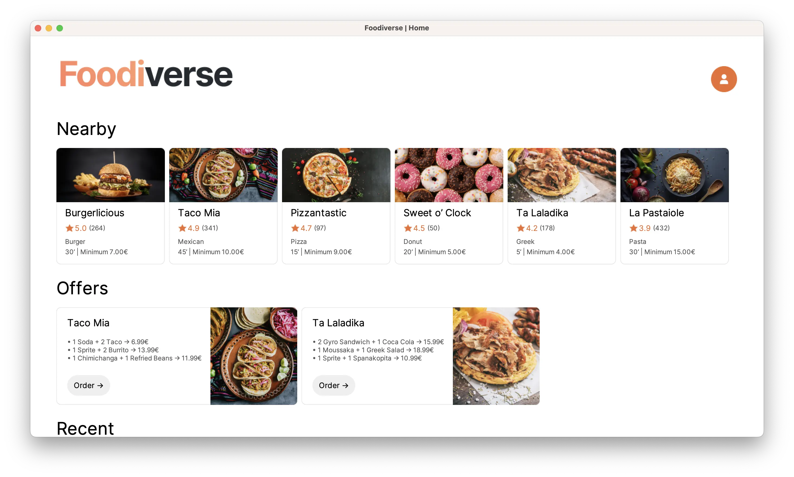

# Foodiverse

An online delivery application built with Java Swing.

## 🏛️ Architecture

### [`/app`](https://github.com/food-verse/foodverse/tree/main/src/main/java/com/foodverse/app)

This is the entry point of the application.

### [`/models`](https://github.com/food-verse/foodverse/tree/main/src/main/java/com/foodverse/models)

This is where the data classes of the application lie.

### [`/overlays`](https://github.com/food-verse/foodverse/tree/main/src/main/java/com/foodverse/overlays)

The overlays of the application live here. Overlays are widgets that get their own id and can be later added to the router **with** their own underlying frame.

### [`/pages`](https://github.com/food-verse/foodverse/tree/main/src/main/java/com/foodverse/pages)

The pages of the application live here. Pages are widgets that get their own id and can be later added to the router **without** an underlying frame.

### [`/utility`](https://github.com/food-verse/foodverse/tree/main/src/main/java/com/foodverse/utility)

Utilities folder includes many helper classes for navigation, input validation, asset loading, file manipulation and database handling.

### [`/views`](https://github.com/food-verse/foodverse/tree/main/src/main/java/com/foodverse/views)

This is where the views of the application lie. Views are reusable blocks of widgets that describe a part of the user interface. Views are themselves widgets too.

### [`/widgets`](https://github.com/food-verse/foodverse/tree/main/src/main/java/com/foodverse/widgets)

The widgets of the application live here. Widgets are reusable blocks of code that implement a single method called [`getRef()`](https://github.com/food-verse/foodverse/blob/a39006f15a34a7f5f0dc05d1d0fe42e768ecebaf/src/main/java/com/foodverse/utility/core/Widget.java#L13) which returns a reference to its underlying component. Widgets can also be nested into other widgets, pages or overlays accordingly.

## 📸 Screenshots

